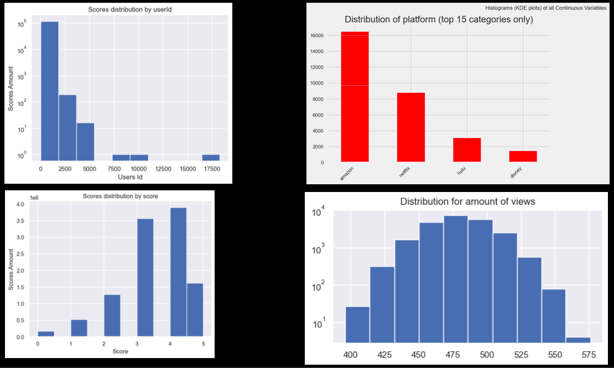
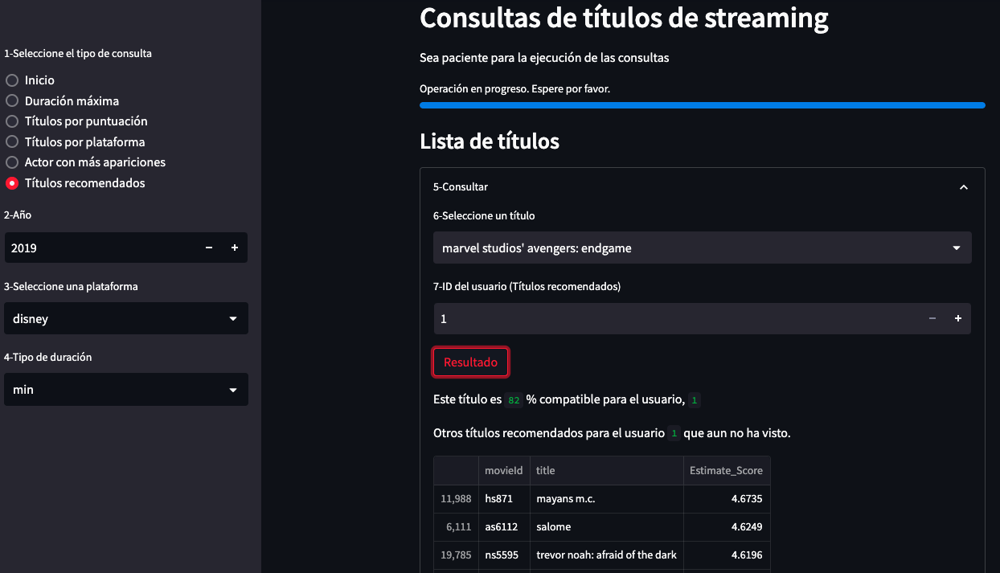

# <h1 align=center> **HENRY LABS** </h1>
## <h1 align=center> **PROYECTO INDIVIDUAL Nº1** </h1>

# <h1 align=center>"Sistema de recomendación de servicios de streaming" </h1>

## Video presentacion
🔹 https://youtu.be/L5ZxSU4dr7w

## Contexto
La startup provee servicios de agregación de plataformas de streaming y necesita un sistema de recomendación para mejorar la experiencia del usuario. 

## Propuesta de trabajo
El proyecto sigue un enfoque iterativo basado en el ciclo de vida de los proyectos de **Machine Learning**. El objetivo es proporcionar un **MVP** en una semana. Para ello, se plantea la siguiente propuesta de trabajo:

## Arquitectura del proyecto

## Transformaciones de datos
El proceso completo de **ETL** se realizo en el archivo **1-ETL.ipynb**, la informacion procesada se guardo en la carpeta **processed_data**.
Se realizaron las siguientes transformaciones de datos segun se indica en 0-Consignas.md : 

+ Generar campo **`id`**: Cada id se compondrá de la primera letra del nombre de la plataforma, seguido del show_id ya presente en los datasets (ejemplo para títulos de Amazon = **`as123`**)

+ Los valores nulos del campo rating deberán reemplazarse por el string “**`G`**” (corresponde al maturity rating: “general for all audiences”

+ De haber fechas, deberán tener el formato **`AAAA-mm-dd`**

+ Los campos de texto deberán estar en **minúsculas**, sin excepciones

+ El campo ***duration*** debe convertirse en dos campos: **`duration_int`** y **`duration_type`**. El primero será un integer y el segundo un string indicando la unidad de medición de duración: min (minutos) o season (temporadas)

## Desarrollo de la API:  
Las 4 consultas de probaron en el archivo **2-Queries.ipynb**   
Se utilizo el framework FastAPI para disponibilizar los datos de la empresa. Se han definido las siguientes consultas:  

+ Query 1: Título con mayor duración con filtros opcionales de AÑO, PLATAFORMA Y TIPO DE DURACIÓN. (función get_max_duration(year, platform, duration_type)).  
+ Query 2: Cantidad de títulos por plataforma con un puntaje mayor a XX en determinado año (la función get_score_count(platform, scored, year))
+ Query 3: Cantidad de títulos por plataforma con filtro de PLATAFORMA. (La función get_count_platform(platform)).  
+ Query 4: Actor que más se repite según plataforma y año. (La función get_actor(platform, year)).  

## Deployment de consultas:  
El deployment se hace a traves del archivo **main.py** y un **Dockerfile**  
Se ha optado por render.com para hacer el deployment de las consultas. Se pueden realizar las consultas a traves de la interfaz que proporciona FasAPI: 🔹 https://pi-ml-ops-86eh.onrender.com/docs#/  
Alternativamente y para agilizar las consultas se proporcionan queries de ejemplo a traves de la barra de direcciones del navegador para probar la api:  
🔹 https://pi-ml-ops-86eh.onrender.com/max_duration/2019/disney/min  
🔹 https://pi-ml-ops-86eh.onrender.com/score_count/disney/5/2019   
🔹 https://pi-ml-ops-86eh.onrender.com/count_platform/disney  
🔹 https://pi-ml-ops-86eh.onrender.com/get_actor/disney/2019  

## Análisis exploratorio de datos:   
En el archivo **3-EDA.ipynb** se realizo el **EDA**, en la carpeta EDA se almacenaron las imagenes de este analisis, y un archivo EDA.pdf  
Se realizo un análisis exploratorio de datos para investigar las relaciones entre las variables de los datasets, detectar outliers o anomalías y explorar patrones interesantes.  

 

## Sistema de recomendación:  
En el archivo **4-ML.ipynb** se desarrollo el modelo de **Machine Learning**, 
Una vez finalizado el **ETL** y el **EDA**, se debe entreno un modelo de ML para armar un sistema de recomendación de películas para usuarios. El modelo es capaz de recomendar películas a un usuario dado su ID y una película. 

## Deployment de la aplicacion:
El deployment de las cuantro consultas y el sistema de recomendacion se encuentra en el archivo **5-Deploy.py**, para esto se utilizo Streamlit: 
🔹 https://lucianolarrea-pi-ml-ops-4-ml-streamlit-1jg5jc.streamlit.app/

 

Adicionalmente muestra una lista de peliculas recomendadas que no ha visto el usuario.

## Estructura del repositorio:  
En el repositorio se encontrarán los siguientes archivos y carpetas:

README.md: Contiene la descripción del proyecto, sus objetivos, y los pasos necesarios para reproducirlo.

0-Consignas.md: Este archivo contiene los lineamientos y la informacion de base para desarrollar el proyecto.

Data: Esta carpeta contiene los datasets en formato CSV utilizados en el proyecto.

1-ETL.ipynb: Contiene la transformacion y adecuacion de datos para su posterior uso.

Processed_data: Esta carpeta contiene los archivos resultantes del ETL.

2-Queries.ipynb: Contiene el desarrollo de las 4 consultas que sirven de base para el deployment.

3-EDA.ipynb: Contiene un análisis exploratorio de los datos, las imagenes se guardan en la carpeta EDA.

4-ML.ipynb: Contiene el modelado y entrenamiento del modelo de Machine Learning para el sistema de recomendación.

5-Deployment.py: Contiene el codigo necesario para hacer el deployment completo de la aplicacion.

main.py: Contiene el codigo necesario para hacer el deployment de las consultas en render.com

Dockerfile: Archivo necesario para hacer el deployment en render.com

requirements.txt: Contiene una lista de todas las dependencias necesarias para ejecutar el deployment con Streamlit.

src: Esta carpeta contiene las imagenes utilizadas por los archivos .md

En general, la estructura del repositorio sigue una organización lógica de los diferentes componentes del proyecto, con una carpeta para cada uno de ellos, y una separación clara entre los archivos de datos, el código fuente, la documentación y las pruebas. Además, se incluyen los archivos necesarios para el deployment en Streamlit.

🟣 Notas finales: 🟣
😇 Muchas gracias por su visita!
☕ takticflow@gmail.com